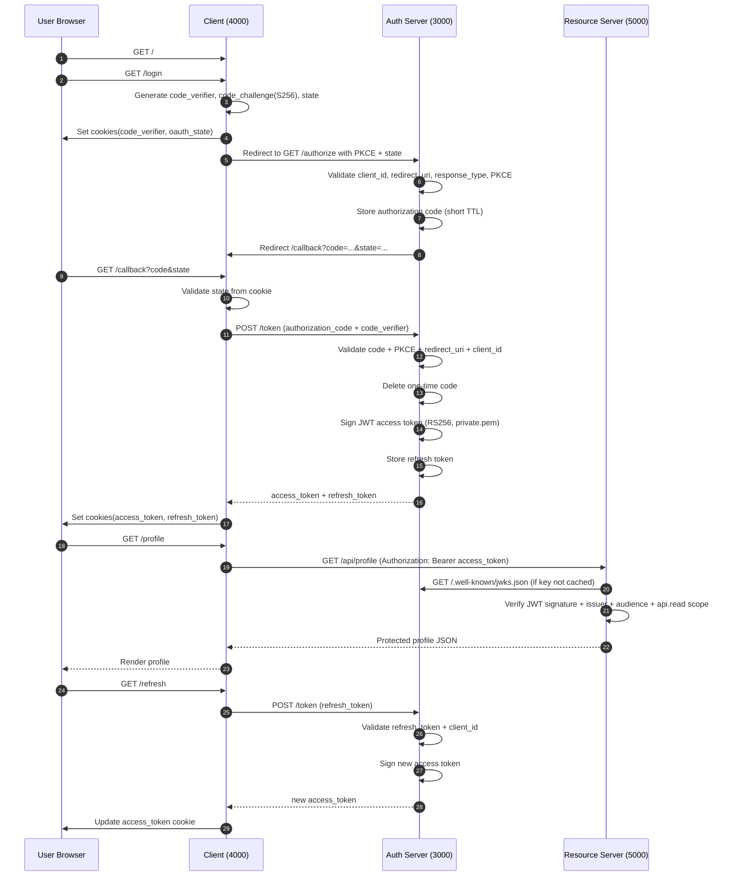

# OAuth2 Learning: 3-App Demo

This project demonstrates OAuth 2.0 Authorization Code Flow with PKCE using three Node.js apps:

- `auth-server` (Authorization Server) on `http://localhost:3000`
- `client` (OAuth Client / Relying Party) on `http://localhost:4000`
- `resource-server` (Protected API) on `http://localhost:5000`

## Project Structure

```text
oauth2-learning/
  auth-server/
    index.js
    package.json
  client/
    index.js
    package.json
  resource-server/
    index.js
    package.json
```

## OAuth2 Model (What each app does)

## Detailed Drawing (Architecture + Flow)

### Architecture Diagram

```mermaid
flowchart LR
    U[User Browser]

    subgraph C[Client App - localhost:4000]
        C1[GET /]
        C2[GET /login]
        C3[GET /callback]
        C4[GET /profile]
        C5[GET /refresh]
        CStore[(HTTP-only cookies)\ncode_verifier, oauth_state,\naccess_token, refresh_token]
    end

    subgraph A[Authorization Server - localhost:3000]
        A1[GET /authorize]
        A2[POST /token]
        A3[GET /.well-known/jwks.json]
        AStore1[(clients)]
        AStore2[(authorizationCode)]
        AStore3[(refreshTokens)]
        AKey[(private.pem/public.pem)]
    end

    subgraph R[Resource Server - localhost:5000]
        R1[GET /api/profile]
        RJWKS[Remote JWKS cache]
    end

    U -->|open app + click login| C1
    C1 --> C2
    C2 --> CStore
    C2 -->|302 redirect with PKCE + state| A1
    A1 --> AStore1
    A1 --> AStore2
    A1 -->|302 back with code + state| C3
    C3 --> CStore
    C3 -->|POST /token\n(grant_type=authorization_code)| A2
    A2 --> AStore2
    A2 --> AStore3
    A2 --> AKey
    A2 -->|access_token + refresh_token| C3
    C3 --> CStore
    C4 -->|Bearer access_token| R1
    R1 --> RJWKS
    RJWKS -->|fetch keys| A3
    C5 -->|POST /token\n(grant_type=refresh_token)| A2
    A2 -->|new access_token| C5
    C5 --> CStore
```

### Sequence Diagram (Authorization Code + PKCE + Refresh)



### 1) Authorization Server (`auth-server`)

Responsibilities:
- Handles `/authorize` and `/token`
- Validates client, redirect URI, PKCE challenge/verifier
- Issues access tokens and refresh tokens
- Exposes JWKS at `/.well-known/jwks.json` for token signature verification

In-memory stores:
- `clients`: registered OAuth clients
- `authorizationCode`: temporary auth codes
- `refreshTokens`: refresh-token records

Main endpoints:
- `GET /authorize`
- `POST /token`
- `GET /.well-known/jwks.json`

### 2) Client App (`client`)

Responsibilities:
- Starts login (`/login`) by generating PKCE values and redirecting to auth server
- Handles callback (`/callback`) and exchanges code for tokens
- Stores tokens in cookies
- Calls protected resource (`/profile`)
- Refreshes access token (`/refresh`)

Main endpoints:
- `GET /`
- `GET /login`
- `GET /callback`
- `GET /profile`
- `GET /refresh`

### 3) Resource Server (`resource-server`)

Responsibilities:
- Verifies Bearer access tokens via auth server JWKS
- Enforces issuer/audience checks
- Enforces required scope (`api.read`)
- Returns protected profile data

Main endpoint:
- `GET /api/profile`

## End-to-End Flow (Authorization Code + PKCE)

1. User opens `client` and clicks Login.
2. `client` creates:
   - `code_verifier`
   - `code_challenge = SHA256(code_verifier)` (base64url)
   - `state`
3. `client` redirects browser to `auth-server /authorize` with query params:
   - `response_type=code`
   - `client_id`
   - `redirect_uri`
   - `scope` (e.g. `api.read openid profile email`)
   - `state`
   - `code_challenge`, `code_challenge_method=S256`
4. `auth-server` validates request, issues authorization code, redirects back to `client /callback?code=...&state=...`.
5. `client` calls `auth-server /token` with:
   - `grant_type=authorization_code`
   - `code`
   - `redirect_uri`
   - `client_id`
   - `code_verifier`
6. `auth-server` validates PKCE and issues:
   - `access_token`
   - `refresh_token`
7. `client` calls `resource-server /api/profile` with `Authorization: Bearer <access_token>`.
8. `resource-server` verifies JWT via JWKS and checks `api.read` scope.

Refresh flow:
1. `client` sends `grant_type=refresh_token` to `auth-server /token`.
2. `auth-server` validates refresh token and returns a new access token.

## Install and Run

### 1) Install dependencies

From project root:

```bash
cd auth-server && npm install
cd ../client && npm install
cd ../resource-server && npm install
```

For `auth-server` key setup, see [create private / public key with openssl](auth-server/create-private-public-key-openssl.md).

### 2) Run all apps (development mode)

Use three terminals:

```bash
# terminal 1
cd auth-server && npm run dev
```

```bash
# terminal 2
cd resource-server && npm run dev
```

```bash
# terminal 3
cd client && npm run dev
```

Then open: `http://localhost:4000`

### 3) Run all apps (start mode)

Use three terminals:

```bash
# terminal 1
cd auth-server && npm start
```

```bash
# terminal 2
cd resource-server && npm start
```

```bash
# terminal 3
cd client && npm start
```

## Notes

- This is a learning/demo setup, not production hardening.
- State, authorization codes, and refresh tokens are stored in memory (lost on restart).
- The signing keys are saved as local files (`private.pem`/`public.pem`) inside this project.
- In production, many teams keep private keys in a managed key service or hardware module (KMS/HSM) instead of plain files for stronger security.
- Resource server checks that `api.read` is present; extra scopes are allowed.
